# Agent Framework Methodology

## Core Philosophy

This agent framework is designed for **composable, domain-agnostic coordination** that works standalone or in complex workflows. Agents are tools with specific functions, not human-like assistants.

## Architecture Pattern

### **Orchestrator → Specialist → Domain Expert**

1. **Primary Orchestrator** (`build-enhanced.md`)
   - Adaptive workflow coordination based on task complexity
   - Routes simple tasks directly, coordinates complex workflows
   - Never implements - only understands, routes, coordinates, validates

2. **Specialists** (`specialist-*`)
   - Handle specific processes and workflows (testing, review, architecture, etc.)
   - Orchestrate complex processes using Integration Points
   - Focus on coordination and requirements, not implementation
   - Tech stack agnostic - work with any domain experts

3. **Domain Experts** (`domain-*`)
   - Provide deep technical knowledge in specific areas
   - Execute specific implementations (Python, TypeScript, cloud, etc.)
   - Pure expertise, no workflow orchestration
   - Invoked by specialists as needed

4. **Meta Agents** (`meta-*`)
   - Provide system-level coordination capabilities
   - Context management, artifact organization, error coordination
   - Optional - activate when coordination adds value
   - Domain-agnostic - work for technical and non-technical workflows

## Build-Enhanced Workflow


## Agent Type Relationships

```mermaid
graph TB
    %% User and Primary Orchestrator
    User["👤 USER REQUEST"]
    PO["🎯 PRIMARY ORCHESTRATOR<br/><i>build-enhanced.md</i><br/>Routes • Coordinates • Validates<br/>Never implements"]
    
    %% Agent Type Categories
    subgraph AgentTypes ["AGENT ECOSYSTEM"]
        
        subgraph Specialists ["🔄 SPECIALISTS<br/><i>Process Orchestration</i>"]
            direction TB
            SpecRole["• Handle specific processes<br/>• Tech stack agnostic<br/>• Focus on coordination<br/>• Use Integration Points"]
            SpecExamples["Examples:<br/>specialist-frontend<br/>specialist-security<br/>specialist-architect"]
        end
        
        subgraph DomainExperts ["🛠️ DOMAIN EXPERTS<br/><i>Technical Implementation</i>"]
            direction TB
            DomainRole["• Deep technical knowledge<br/>• Pure expertise focus<br/>• Invoked as needed<br/>• No workflow orchestration"]
            DomainExamples["Examples:<br/>domain-python-engineer<br/>domain-cloud-architect<br/>domain-typescript-engineer"]
        end
        
        subgraph MetaAgents ["🧠 META AGENTS<br/><i>System Coordination</i>"]
            direction TB
            MetaRole["• System-level coordination<br/>• Optional activation<br/>• Domain-agnostic<br/>• Context & artifact management"]
            MetaExamples["Examples:<br/>meta-agent-selector<br/>meta-context-manager<br/>meta-artifact-manager"]
        end
    end
    
    %% Integration Points System
    subgraph IntegrationSystem ["🔗 INTEGRATION POINTS SYSTEM"]
        direction TB
        
        subgraph CapabilityCoord ["Capability-Based Coordination"]
            CapDesc["Agent describes needed capability:<br/>'Coordinate with backend teams<br/>for API contracts and schemas'"]
            
            Discovery["meta-agent-selector<br/>discovers matching agents"]
            
            FlexMatch["Flexible matching:<br/>• Any agent with capability works<br/>• Resilient to agent changes<br/>• Dynamic routing optimization"]
        end
        
        subgraph ArtifactCoord ["Lightweight Artifact Coordination"]
            Frontmatter["Optional frontmatter:<br/>type: frontend-requirements<br/>provides: api-requirements<br/>uses: user-requirements"]
            
            UniversalKeys["Universal capability keys:<br/>• requirements, constraints<br/>• strategy-analysis, specifications<br/>• validation-results, deliverables"]
        end
    end
    
    %% Relationship flows
    User --> PO
    
    %% Primary Orchestrator routing
    PO -->|"Route & Coordinate"| Specialists
    PO -->|"Complex workflows"| MetaAgents
    PO -.->|"Direct routing<br/>(simple tasks)"| DomainExperts
    
    %% Specialist coordination
    Specialists -->|"Request expertise via<br/>Integration Points"| DomainExperts
    Specialists <-->|"Coordinate processes"| Specialists
    
    %% Meta agent coordination
    MetaAgents -.->|"Discover & route"| Specialists
    MetaAgents -.->|"Context & artifacts"| DomainExperts
    MetaAgents -.->|"System coordination"| MetaAgents
    
    %% Integration Points flows
    Specialists --> CapDesc
    CapDesc --> Discovery
    Discovery --> FlexMatch
    FlexMatch --> DomainExperts
    
    %% Artifact coordination
    Specialists --> Frontmatter
    DomainExperts --> Frontmatter
    Frontmatter --> UniversalKeys
    UniversalKeys --> MetaAgents
    
    %% Key Benefits callout
    Benefits["🎯 KEY BENEFITS<br/>✅ Full composability<br/>✅ Flexible agent discovery<br/>✅ No hardcoded dependencies<br/>✅ Resilient to changes<br/>✅ Works standalone or in workflows<br/>✅ Domain-agnostic coordination"]
    
    FlexMatch -.-> Benefits
    
    %% Styling
    classDef userNode fill:#37474f,color:#ffffff,stroke:#546e7a,stroke-width:3px
    classDef primaryNode fill:#1a237e,color:#ffffff,stroke:#3f51b5,stroke-width:4px
    classDef specialistBox fill:#4a148c,color:#ffffff,stroke:#7b1fa2,stroke-width:3px
    classDef domainBox fill:#1b5e20,color:#ffffff,stroke:#4caf50,stroke-width:3px
    classDef metaBox fill:#e65100,color:#ffffff,stroke:#ff9800,stroke-width:3px
    classDef integrationBox fill:#263238,color:#ffffff,stroke:#37474f,stroke-width:3px
    classDef capabilityBox fill:#1565c0,color:#ffffff,stroke:#2196f3,stroke-width:2px
    classDef artifactBox fill:#6a1b9a,color:#ffffff,stroke:#8e24aa,stroke-width:2px
    classDef roleBox fill:#f8f9fa,stroke:#495057,stroke-width:2px
    classDef exampleBox fill:#e8f5e8,stroke:#1b5e20,stroke-width:1px
    classDef benefitBox fill:#2e7d32,color:#ffffff,stroke:#4caf50,stroke-width:3px
    classDef coordBox fill:#ffffff,stroke:#666,stroke-width:2px
    
    class User userNode
    class PO primaryNode
    class Specialists specialistBox
    class DomainExperts domainBox
    class MetaAgents metaBox
    class IntegrationSystem integrationBox
    class CapabilityCoord capabilityBox
    class ArtifactCoord artifactBox
    class SpecRole,DomainRole,MetaRole roleBox
    class SpecExamples,DomainExamples,MetaExamples exampleBox
    class Benefits benefitBox
    class CapDesc,Discovery,FlexMatch,Frontmatter,UniversalKeys coordBox
```



## Design Principles

### **Composability & Flexibility**
- **Any specialist** can invoke any domain expert
- **Any combination** works standalone or in workflows  
- **Integration Points** enable flexible agent discovery
- **No hardcoded dependencies** - agents adapt to available capabilities

### **Domain Agnostic**
- **Specialists** work across technical and non-technical domains
- **Meta agents** coordinate any type of workflow (legal, marketing, technical, etc.)
- **Universal capability keys** for cross-domain coordination
- **Consistent patterns** regardless of domain

### **Human-Readable Artifacts**
- **All outputs** are markdown with optional frontmatter
- **Lightweight coordination** through frontmatter capability keys
- **No complex protocols** - just standardized data formats
- **Readable by humans**, processable by agents

### **Context Efficiency**
- **Minimal context bloat** through focused, single-purpose agents
- **Optional coordination** - no unnecessary overhead
- **Logical artifact names** managed by meta-artifact-manager
- **Token optimization** without sacrificing functionality

## Coordination Mechanisms

### **Integration Points (Soft Coordination)**
Agents describe capabilities they need, not specific agents:

```markdown
### API Design Coordination
- Coordinate with backend teams for API contracts and data schemas
- Request frontend data requirements and error handling patterns
- Ensure consistent validation and security requirements
```

**Benefits:**
- Flexible agent discovery via meta-agent-selector
- Works with any agent providing the capability
- Resilient to agent changes and additions
- Enables dynamic routing optimization

### **Capability Keys (Lightweight Coordination)**
Optional frontmatter for artifact coordination:

```markdown
---
type: frontend-requirements
provides: api-requirements, error-patterns
uses: user-requirements, component-design
---
```

**Universal Capability Keys:**
- `requirements`, `constraints`, `stakeholder-needs`
- `strategy-analysis`, `process-design`, `specifications`
- `validation-results`, `compliance-verification`, `audit-findings`
- `automation-scripts`, `procedures`, `deliverables`

### **Context Management**
- **meta-context-manager** preserves state across sessions
- **Logical names** map to organized file structures
- **Automatic summaries** for workflow visibility
- **Graceful degradation** when coordination unavailable

## Agent Organization

### **Folder Structure**
```
/agent/
├── build-enhanced.md              # Primary orchestrator
├── /development/                 # Product development (28 agents)
│   ├── specialist-*.md          # Process orchestration
│   └── domain-*.md              # Technical expertise  
├── /operations/                  # Quality & maintenance (17 agents)
│   ├── specialist-*.md          # Quality processes
│   └── domain-*.md              # Specialized knowledge
└── /meta/                        # Meta-level coordination (9 agents)
    └── meta-*.md                # System coordination
```

### **Naming Conventions**
- `specialist-{process}` - Workflow orchestration (testing, review, architecture)
- `domain-{area}-{role}` - Deep expertise (python-engineer, cloud-architect)
- `meta-{function}` - System coordination (context-manager, task-distributor)

## Workflow Modes

### **Simple Direct Routing**
```
"Create a login form" → Frontend specialist → Done
```
- Minimal coordination overhead
- Direct specialist execution
- Self-contained deliverables

### **Multi-Agent Workflows**
```
"Build authentication system" → 
Strategy → Architecture → Implementation → Testing → Review
```
- Artifact management for organization
- Context preservation across specialists
- Quality gates and validation
- Coordinated parallel execution

### **Cross-Domain Workflows**
```
"Legal compliance automation" → 
Legal analysis → Process design → Implementation → Compliance validation
```
- Universal capability keys enable coordination
- Cross-functional specialist collaboration
- Domain-agnostic meta agent coordination

## Key Features

### **Full Composability**
- **Individual use**: Any agent works standalone
- **Partial workflows**: Any specialist combination
- **Custom orchestration**: Build your own coordination
- **Complete SDLC**: Full primary orchestrator workflow

### **Adaptive Coordination**
- **Simple tasks**: Direct routing without overhead
- **Complex projects**: Full meta agent coordination
- **Smart discovery**: System finds optimal agent combinations
- **Graceful degradation**: Works with subset of agents

### **Universal Applicability**
- **Technical**: Software development, system architecture, DevOps
- **Business**: Marketing campaigns, process optimization, strategy
- **Legal**: Contract analysis, compliance verification, risk assessment
- **Operations**: Automation, workflow design, quality management

## Current Statistics
- **Total Agents:** 54
- **Development:** 28 agents (planning, implementation, infrastructure)
- **Operations:** 17 agents (quality, security, documentation, UX)  
- **Meta:** 9 agents (coordination, optimization, management)
- **Primary:** 1 agent (adaptive orchestration)

## Agent Structure & Configuration

### **Required Fields**

**All agents must include:**
```yaml
---
description: Clear, concise description of agent purpose and capabilities
mode: subagent | primary | all
model: anthropic/claude-{model}-{version}
---
```

**Optional Fields:**
```yaml
temperature: 0.0-1.0  # Default: 0 (most models), 0.55 (Qwen)
tools:               # Only needed if restricting from defaults
  read: true|false   # Default: true
  write: true|false  # Default: true  
  edit: true|false   # Default: true
  grep: true|false   # Default: true
  glob: true|false   # Default: true
  webfetch: true|false # Default: true
  bash: true|false   # Default: true
  list: true|false   # Default: true
  todowrite: true|false # Default: true
  todoread: true|false  # Default: true
permission:           # Control dangerous operations
  edit: allow|ask|deny  # Default: allow
  bash: allow|ask|deny  # Default: allow
  webfetch: allow|ask|deny # Default: allow
```

### **Model Selection Guide**

**💰 Cost & Capability Hierarchy:**

**Haiku (`anthropic/claude-haiku-4-20250514`)** - Fast, cheap
- **Use for:** Simple, structured tasks with clear patterns
- **Examples:** Diagram creation, basic coordination, simple data processing
- **Characteristics:** Template-driven, rule-based, minimal creativity needed

**Sonnet (`anthropic/claude-sonnet-4-20250514`)** - Balanced
- **Use for:** Most development tasks requiring moderate reasoning
- **Examples:** Code implementation, standard analysis, API design
- **Characteristics:** Solid reasoning, good for most technical work

**Opus (`anthropic/claude-opus-4-1-20250805`)** - Powerful, expensive
- **Use for:** Complex reasoning, creative problem solving, deep analysis
- **Examples:** System architecture, AI/ML systems, complex documentation
- **Characteristics:** Advanced reasoning, creative solutions, complex synthesis

**Current Distribution:**
- **Haiku:** 13 agents (24%) - Meta coordination, simple structured tasks
- **Sonnet:** 36 agents (67%) - Most development and operational work
- **Opus:** 5 agents (9%) - Complex reasoning tasks only

### **Agent Type Patterns**

**1. Primary Orchestrator (`build-enhanced.md`)**
```yaml
mode: primary
model: anthropic/claude-sonnet-4-20250514
tools:
  edit: false  # Orchestrates, doesn't implement
  bash: false
permission:
  edit: deny
  bash: deny
```

**2. Architecture/Planning Specialists**
```yaml
mode: subagent  
model: anthropic/claude-sonnet-4-20250514 # or opus for complex systems
tools:
  edit: false  # Planning only, no implementation
  bash: false
permission:
  edit: deny
  bash: deny
```

**3. Implementation Domain Experts**
```yaml
mode: subagent
model: anthropic/claude-sonnet-4-20250514
tools:
  # All tools enabled (default)
permission:
  edit: ask    # Controlled access for safety
  bash: ask
  webfetch: allow
```

**4. Review/Analysis Specialists**
```yaml
mode: subagent
model: anthropic/claude-sonnet-4-20250514
tools:
  edit: false  # Read-only analysis
  bash: false
permission:
  edit: deny
  bash: deny
```

**5. Meta Coordination Agents**
```yaml
mode: subagent
model: anthropic/claude-haiku-4-20250514  # Simple coordination
tools:
  edit: false  # Coordination, not implementation
  bash: false
permission:
  edit: deny
  bash: deny
```

**6. Operations/DevOps Agents**
```yaml
mode: subagent
model: anthropic/claude-sonnet-4-20250514
tools:
  # Full access needed for operational tasks
permission:
  edit: ask    # Controlled but capable
  bash: ask
```

## Required Agent Sections

### **1. Specialist Agents Structure**

**Required Sections:**
```markdown
## Core Responsibilities
- Primary functions and ownership areas
- Process coordination duties
- Quality gates and validation criteria

## Integration Points
### {Domain} Coordination
- Coordinate with {domain} experts for {specific needs}
- Request {capability} expertise for {use cases}
- Ensure {standards/requirements} are met

### Quality Output Management
- **In Full Workflow**: Output `{logical-name}` via artifact-manager
- **Standalone Use**: Direct output to specified location
- **Content**: {What the artifact contains}
- **Format**: {Structure and format requirements}

### Meta-Level Coordination
- Request artifact management for {organization needs}
- Request error coordination for {failure scenarios}
- Request context management for {state requirements}
```

**Example Integration Points:**
```markdown
## Integration Points

### Backend Development Coordination
- Coordinate with backend engineers for API implementation and database design
- Request infrastructure expertise for deployment and scaling requirements
- Ensure security standards and performance requirements are met

### Quality Output Management
- **In Full Workflow**: Output `frontend-implementation` via artifact-manager
- **Standalone Use**: Return component code and documentation directly
- **Content**: React components, styles, tests, and integration guides
- **Format**: Structured markdown with code blocks and setup instructions

### Meta-Level Coordination
- Request artifact management for organizing component libraries and documentation
- Request error coordination for handling build failures and deployment issues
- Request workflow analysis for optimizing development processes
```

### **2. Domain Expert Structure**

**Required Sections:**
```markdown
## {Language/Technology} Standards
- Language-specific best practices and conventions
- Framework choices and architectural patterns
- Performance and security considerations

## Focus Areas
- Core competencies and specializations
- Technology stack and tool expertise
- Integration patterns and APIs

## Approach
1. {Key principle 1}
2. {Key principle 2}
3. {Key principle 3}
4. {Key principle 4}
5. {Key principle 5}

## Output
- {Deliverable type 1} with {quality criteria}
- {Deliverable type 2} with {standards}
- {Deliverable type 3} with {requirements}
```

### **3. Meta Agent Structure**

**Required Sections:**
```markdown
## Operating Principle
**{Core behavior statement}.** {When to activate and core function}

## Primary Functions
### {Function 1}
- {Capability description}
- {Use cases and benefits}

### {Function 2}  
- {Capability description}
- {Integration patterns}

## Integration Pattern
- **Activation**: {When this agent is needed}
- **Input**: {What it receives from other agents}
- **Processing**: {How it transforms or coordinates}
- **Output**: {What it provides back to workflow}
```

### **4. Primary Orchestrator Structure**

**Required Sections:**
```markdown
## Core Process
### 1. **Understand**
- {Analysis and interpretation duties}

### 2. **Route** 
- {Routing and agent selection logic}

### 3. **Coordinate**
- {Workflow orchestration responsibilities}

### 4. **Validate**
- {Quality assurance and completion verification}

## Routing Logic
- Simple tasks: Direct specialist assignment
- Complex workflows: Multi-stage coordination
- Cross-domain needs: Meta agent activation

## Quality Gates
- {Validation criteria and standards}
- {Completion requirements}
- {Success metrics}
```

## Security & Access Control

### **Permission Levels**
- **`allow`** - Full access, no prompts
- **`ask`** - Controlled access, requires confirmation
- **`deny`** - Blocked access, tool unavailable

### **Access Patterns**
- **Planning agents:** `edit: deny, bash: deny` (read-only analysis)
- **Implementation agents:** `edit: ask, bash: ask` (controlled modification)
- **Operations agents:** `edit: ask, bash: ask` (controlled but capable)
- **Coordination agents:** `edit: deny, bash: deny` (coordination only)

### **Security Best Practices**
- Never expose secrets or credentials in prompts
- Use least-privilege access patterns
- Require confirmation for dangerous operations
- Document security considerations in agent descriptions

## Performance Optimization

### **Model Cost Optimization**
- **44% Opus reduction** - Reserved for complex reasoning only
- **62% Haiku increase** - Used for structured, template-driven tasks
- **Estimated 20-30% cost savings** while maintaining capability

### **Token Efficiency**
- Removed redundant frontmatter fields (name, defaults)
- Focused agent descriptions
- Minimal context bloat through single-purpose agents
- Optional coordination reduces overhead

## Agent Creation & Import Guidelines

### **Adding New Agents**

**1. Determine Agent Type & Placement:**
- `specialist-{name}.md` → `/development/` or `/operations/` based on function
- `domain-{area}-{role}.md` → `/development/` or `/operations/` based on domain
- `meta-{function}.md` → `/meta/` for coordination functions

**2. Choose Appropriate Model:**
- **Haiku**: Simple, rule-based tasks (coordination, diagram creation)
- **Sonnet**: Standard development work (most use cases)
- **Opus**: Complex reasoning only (system architecture, AI/ML, advanced analysis)

**3. Set Security Permissions:**
- **Planning/Analysis**: `edit: deny, bash: deny`
- **Implementation**: `edit: ask, bash: ask`
- **Operations**: `edit: ask, bash: ask` 
- **Coordination**: `edit: deny, bash: deny`

**4. Required Sections by Type:**

**Specialists** must include:
- Core Responsibilities
- Integration Points (domain coordination)
- Quality Output Management
- Meta-Level Coordination

**Domain Experts** must include:
- {Technology} Standards
- Focus Areas
- Approach (5 key principles)
- Output (deliverable specifications)

**Meta Agents** must include:
- Operating Principle
- Primary Functions
- Integration Pattern

### **Import Validation Checklist**

**✅ Frontmatter Requirements:**
- [ ] Description is clear and specific
- [ ] Mode is appropriate (`subagent` for most)
- [ ] Model matches task complexity
- [ ] Tools restrictions are role-appropriate
- [ ] Permissions follow security patterns
- [ ] No `name:` field (filename determines name)

**✅ Content Structure:**
- [ ] Required sections for agent type are present
- [ ] Integration Points avoid hardcoded agent references
- [ ] Output specifications are clear
- [ ] Security considerations documented
- [ ] Language is purpose-focused, not anthropomorphic

**✅ Framework Compliance:**
- [ ] Agent is composable (works standalone)
- [ ] Domain-agnostic patterns used
- [ ] Human-readable output format
- [ ] Cost-conscious model selection
- [ ] Follows naming conventions

### **Quality Standards**

**Agent Descriptions:**
- Single line, under 80 characters
- Action-oriented ("Create X", "Analyze Y", "Coordinate Z")
- Specific capabilities, not personality traits
- No "friendly," "helpful," or anthropomorphic language
- Focus on function and expertise, not character

**Integration Points:**
- Use capability descriptions, not agent names
- Enable flexible coordination
- Support both workflow and standalone use
- Include meta-level coordination patterns

**Security & Access:**
- Minimal necessary permissions
- Clear rationale for any special access
- Safe defaults with controlled exceptions
- No credential exposure in prompts

## Current Statistics
- **Total Agents:** 54
- **Development:** 28 agents (planning, implementation, infrastructure)
- **Operations:** 17 agents (quality, security, documentation, UX)  
- **Meta:** 9 agents (coordination, optimization, management)
- **Primary:** 1 agent (adaptive orchestration)
- **Security:** 100% coverage with appropriate access controls
- **Cost Optimized:** 24% Haiku, 67% Sonnet, 9% Opus

## Key Rules

1. **Agents are tools** with specific functions, not assistants
2. **No anthropomorphization** - focus on capabilities, not personality
3. **Integration Points** enable flexible coordination without dependencies
4. **Domain agnostic** - patterns work across technical and non-technical domains
5. **Human readable** - all artifacts remain accessible and understandable
6. **Composable by design** - any combination should work
7. **Optional coordination** - no overhead when not needed
8. **Security by design** - appropriate access controls for each role
9. **Cost conscious** - optimal model selection for task complexity
10. **Structured sections** - consistent organization enables coordination
11. **Validation required** - all new agents must pass import checklist
12. **Framework compliance** - maintain composability and standards